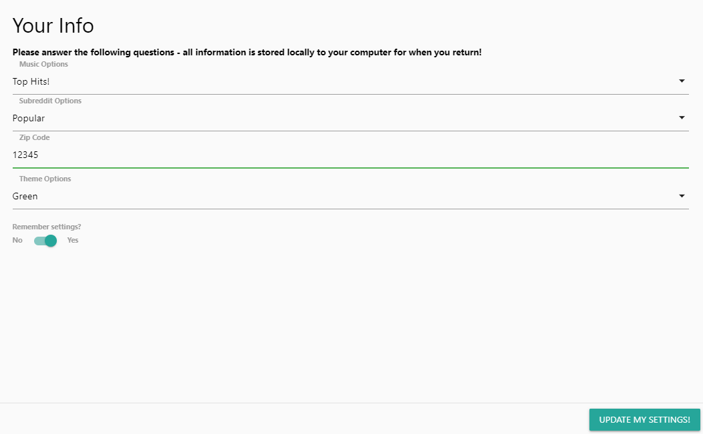

# custom-homepage

Project Title: 
Custom Homepage

Project Description:
This is a custom homepage the user can cater to their own interests. 
Upon intial visit to the site, the user is prompted to click a button to adjust settings and preferences such as location, timezone, music preference, news preferences, and if the settings will be remembered/auto populated upon reopening of the homepage.
The homepage is formatted using the Materialize CSS framework.  
  

Functionality:
- Formatted and built using JS and Materialize CSS
- User presented with clear call to action button on initial load of page  
      
    
- All user input may be updated after initially set
    - Post input  
      
    - Pre-input  
        

- Weather (OpenWeather API): 
    - Location
    - weather summary
    - current temp 
    - current wind speed 
    - current humidity  
      

- Google search widget (Google Search Widget embeded)
    - query creates modal over homepage with results  
      

- Reddit with subreddit selection (Reddit API): 
    - nsfw filter
    - image preview
    - videos are playable from homepage on card
    - click opens link in new page  
      

- Picture slide show (Unsplash API)
    - Pictures rotate on a timer
    - Pictures credit artist
    - Upon click, a new window opens to show artist/unsplash page.  
      

- Music (iHeartRadio Online Radio embeded)
    - User selects radio station to tune into
    - Widget has EQ vizualizer
    - Widget allows user to share station/song information
    - User can click on radio show icon and new tab will open navigating to the radio show's page  
      

- User can select theme to their homepage and an assortment of colors are available
- If inputs are missing an error appears prompting the user to re-input their information  
      

Deployment Link : https://victormendez96.github.io/custom-homepage/

Github Link : https://github.com/VictorMendez96/custom-homepage
